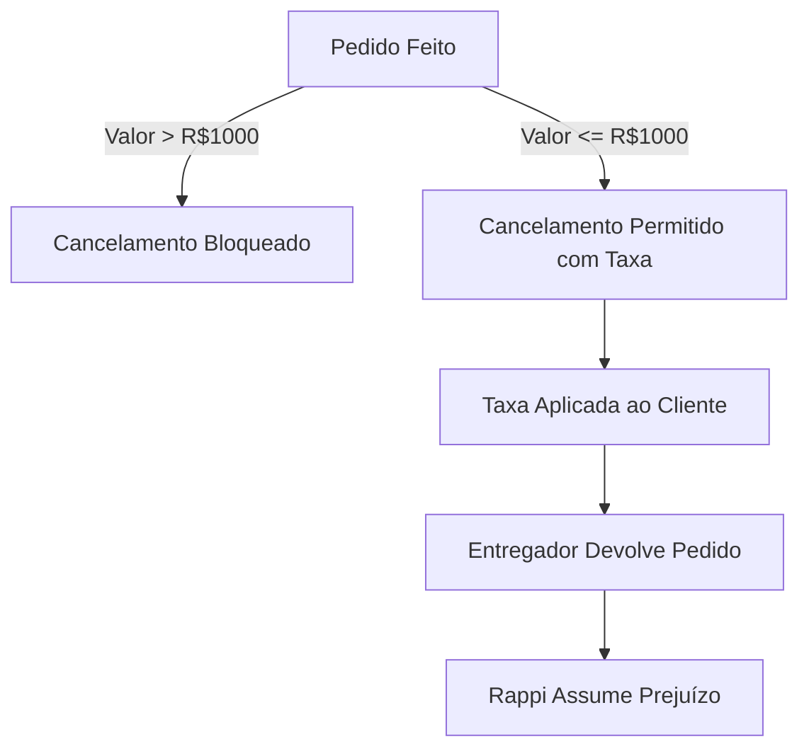

```mermaid
graph TD;
    A[Pedido Feito] -->|Valor > R$1000| B[Cancelamento Bloqueado];
    A -->|Valor <= R$1000| C[Cancelamento Permitido com Taxa];
    C --> D[Taxa Aplicada ao Cliente];
    D --> E[Entregador Devolve Pedido];
    E --> F[Rappi Assume Prejuízo];
```
