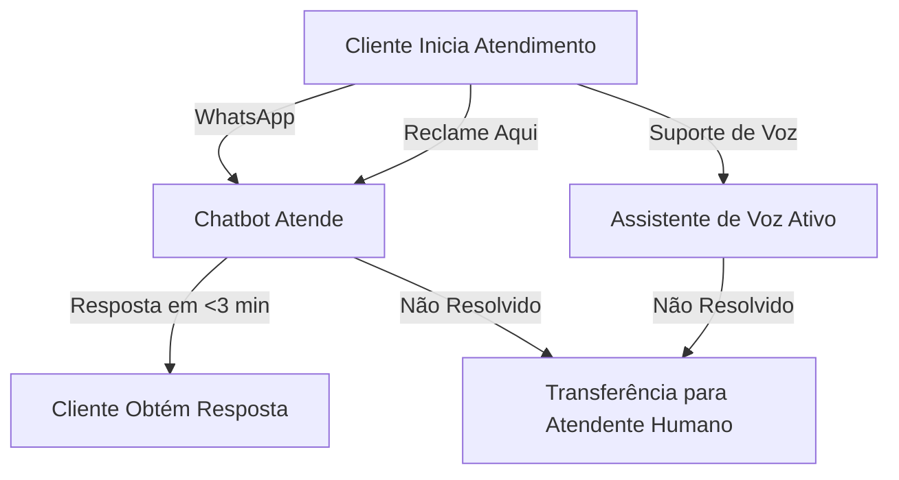

```mermaid
graph TD;
    A[Cliente Inicia Atendimento] -->|WhatsApp| B[Chatbot Atende];
    A -->|Reclame Aqui| B;
    B -->|Resposta em <3 min| C[Cliente Obtém Resposta];
    B -->|Não Resolvido| D[Transferência para Atendente Humano];
    A -->|Suporte de Voz| E[Assistente de Voz Ativo];
    E -->|Não Resolvido| D[Transferência para Atendente Humano];
```